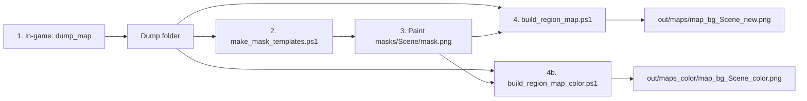

# TerrainDumper

MelonLoader utility mod for *The Long Dark*. Dumps Unity terrain heightmaps and map-alignment metadata from the **currently loaded** region so charcoal-style maps can be built offline (no photogrammetry).

See [GOALS.md](GOALS.md) for the original historical roadmap (ship docs are this README).

## Workflow

Every ship map goes through four steps. Exclusion masks are **required** for every region.

```text
1. In-game dump          dump_map
2. Mask template         make_mask_templates.ps1  →  masks/<Scene>/template.png
3. Paint mask (manual)   export exclude layer     →  masks/<Scene>/mask.png
4. Build map             build_region_map.ps1       →  out/maps/map_bg_<Scene>_new.png
                         build_region_map_color.ps1 →  out/maps_color/map_bg_<Scene>_color.png
```



### 1. Dump a region

1. Launch TLD with MelonLoader.
2. Load Survival → enter the region.
3. **Open the charcoal map once** (so `FogOfWar` populates), then close it.
4. Press **F1** and run `dump_map` (optional args: `dump_map [enrichCellMeters] [orthoGrid] [tileRes]`).

Writes to `Mods/TerrainDumper/<SceneName>/`: terrain heights, `fog_of_war.json`, `alignment_samples.json`, enrichment, then forces **noon** and captures tiled ortho.

### 2–3. Exclusion mask

```text
./tools/make_mask_templates.ps1                  # all dumps under DumpRoot (overwrites templates)
./tools/make_mask_templates.ps1 LakeRegion CoastalRegion
python tools/make_mask_template.py path/to/CoastalRegion   # single region
```

Default **2 m/px**. Always overwrites `template.png` / `mask.json`; does not touch painted `mask.png`. Writes:

```text
masks/<Scene>/
  template.png   # hillshade + world grid (paint guide)
  mask.json      # world bounds + pixel size
```

Paint areas to **exclude** on a new layer, hide the template, export that layer alone as `masks/<Scene>/mask.png` at the same pixel size. Opaque (or non-black without alpha) = excluded.

### 4. Build the map

**Charcoal / legacy ship** (full desat, brown edge tint):

```text
./tools/build_region_map.ps1 CoastalRegion
./tools/build_region_map.ps1 LakeRegion
```

→ `out/maps/map_bg_<Scene>_new.png`.

**Color / vintage** (70% chroma, soft levels, cool dim-gray edge; same void fade 80→black 300 m):

```text
./tools/build_region_map_color.ps1 LongRailTransitionZone
./tools/build_region_map_color.ps1 AshCanyonRegion
./tools/run_map_bg_all_color.ps1
```

→ `out/maps_color/map_bg_<Scene>_color.png`.

Both fail if the painted mask is missing. (`make_map_bg.py --no-mask` is debug-only.)

Copy into DetailedMaps and rebuild that mod manually.

---

## Requirements

- *The Long Dark* (Survival)
- [MelonLoader](https://github.com/LavaGang/MelonLoader) **0.7.2**
- [Developer Console](https://github.com/FINDarkside/TLD-Developer-Console) (enables Hinterland `uConsole`; F1)

Built against Il2Cpp assemblies package `2.51.0` (same baseline as DetailedMaps). Tested on game **2.55**.

## Install

1. Set `TLD_PATH` to your game install folder (e.g. `...\steamapps\common\TheLongDark`). Optionally set `TERRAIN_DUMPER_ROOT` if dumps live elsewhere (defaults to `%TLD_PATH%\Mods\TerrainDumper`).
2. Build (`dotnet build -c Release`), or copy `bin/Release/net6.0/TerrainDumper.dll`.
3. Place into game `Mods/` (PostBuild copies there when `TLD_PATH` is set and `Mods` exists).
4. Ensure `DeveloperConsole.dll` is also in `Mods`.
5. Offline Python tools: `pip install -r requirements.txt`

## Dump output (`formatVersion` 2)

| File | Meaning |
|---|---|
| `meta.json` | Scene name, timestamp, mod/game version, tile list |
| `terrain_NN_heights.raw` | LE `uint16` heights; `round(normalized * 65535)` |
| `terrain_NN_meta.json` | Resolution, size, transform, world bounds |
| `terrain_NN_preview.png` | Grayscale quick-look |
| `fog_of_war.json` | FogOfWar scales/offsets/radii |
| `alignment_samples.json` | `WorldPositionToMapPosition` samples |
| `enrichment_*.raw` / `enrichment_meta.json` | Collider raycast heights + HitClass; v4 adds `enrichment_rock_kind.raw` / `enrichment_rock_snow.raw` |
| `ortho_color_tiled/` | Tiled top-down color capture |

Normalized height → meters ≈ `normalized * size.y + position.y`.

**World → map:** authoritative samples in `alignment_samples.json`. Image UV frame from fog → `±(mapRadiusConstant / detailScale)`. Missing fog is a hard error; `--map-radius` / `--sample-extent` are opt-in only.

## Offline tools

```text
./tools/make_mask_templates.ps1
python tools/make_mask_template.py path/to/<Scene>
python tools/make_map_bg.py path/to/<Scene> --size 4096 --out out/maps/map_bg_<Scene>_new.png
python tools/make_map_bg.py path/to/<Scene> --size 4096 --pipeline color --out out/maps_color/map_bg_<Scene>_color.png
./tools/build_region_map.ps1 <Scene>
./tools/build_region_map_color.ps1 <Scene>
./tools/run_map_bg_all.ps1
./tools/run_map_bg_all.ps1 -Jobs 1
./tools/run_map_bg_all_color.ps1
./tools/run_map_bg_all_color.ps1 -Jobs 2
python tools/preview_heights.py path/to/<Scene>
python tools/check_alignment.py path/to/<Scene> path/to/map_bg.png alignment_check.png
```

Needs `numpy` + `Pillow` (+ `scipy` for inset/mask grow); see `requirements.txt`. Build scripts resolve the dump folder from `TLD_PATH` / `TERRAIN_DUMPER_ROOT` (or `-DumpRoot`).

### `make_map_bg` notes

- Two presentation pipelines share the same DEM/ortho/enrichment/mask/rock-texture path:
  - `--pipeline charcoal` (default): full desaturate → charcoal levels → brown edge tint → grid/stipple/vignette/grain.
  - `--pipeline color`: keep 70% chroma → softer levels → cool dim-gray edge `(48,51,51)`/`(67,71,72)` → same grid/grain/etc.
- Ship default size: **4096** wide, height from fog UV aspect. Void: edge fade 80 m then black over 300 m; signed-distance blur 36 m.
- Rock fill uses TLD albedo tiles from `out/textures/tld_rock_samples/` when present (`--no-rock-textures` for flat fill).
- Auto-uses `ortho_color_tiled` + enrichment when present.
- Border = terrain DEM footprint; enrichment merges **inside** only.
- Mask only subtracts from `valid`; map extent / POI affine are unchanged.
- Useful flags: `--pipeline`, `--mask`, `--mask-grow-m`, `--no-mask` (debug), `--no-enrichment`, `--style charcoal`, `--no-ship-post`, `--edge-fade-m`, `--grid-scope`.

### Other in-game commands

| Command | Hotkey | What |
|---|---|---|
| `dump_ortho_tiled [grid] [tileRes]` | **F8** | Classic tiled hi-LOD ortho (+ fog kill) |
| `dump_ortho_tiled_land [grid] [tileRes]` | — | Land-mode: player stream-wake land pass (water off) + water/void remainder into same atlas → `ortho_color_tiled_land.png` |
| `dump_enrichment [cellMeters]` | **F10** | Collider heights (default 0.25 m) |
| `dump_ortho` / `dump_ortho_clean` | F11 / F12 | Single-shot ortho |
| `dump_walkable [cellMeters] [rasterize]` | **F2** | NavMesh triangulation (+ optional XZ raster; default cell 4, raster 1). Also runs `dump_portals`. |
| `dump_portals` | | `LoadScene` contacts + ExitPoint/EnterPoint markers → `portals.json` |

Trees/walkable are not part of the ship pipeline. Individual dump commands still work alongside `dump_map`.

## Safety

Read-only: no `SetHeights`, no save/settings mutation.

## Build

```text
dotnet build TerrainDumper.csproj -c Release
```
